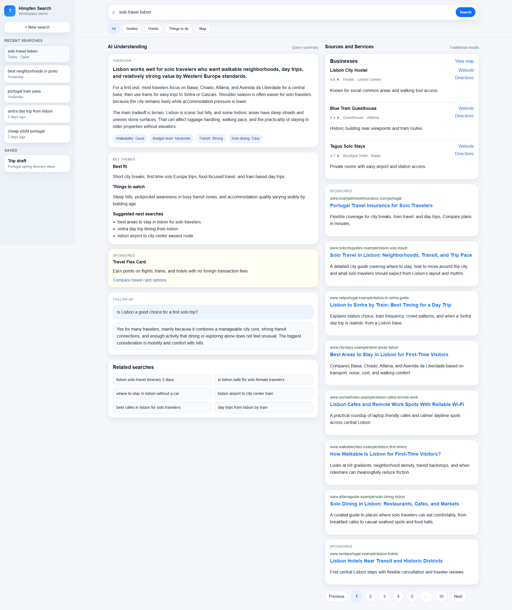

# Himpfen Search

**A search workspace designed for the AI era.**

Himpfen Search is a conceptual interface that explores how search engines might evolve as artificial intelligence becomes a central layer of information discovery.

Instead of presenting results as a single vertical stream, the interface separates search into three distinct but connected layers:

- History: persistent search sessions and research paths.
- AI Understanding: synthesized explanations and contextual insights.
- Sources & Services: traditional web results, businesses, and actions.

The goal is not to replace the open web, but to clarify the roles of AI, sources, and services within the search experience.

# Preview

Add a screenshot of the interface here once available.



A three-panel interface that separates AI understanding from traditional sources and services.

# The Problem

The traditional search interface was designed when search engines primarily retrieved documents.

The typical workflow looked like this:

- Enter a query
- Scan a list of links
- Open multiple pages
- Construct an understanding manually

Modern search systems now perform much more complex tasks:

- interpreting user intent
- synthesizing information across sources
- generating summaries and explanations
- supporting iterative exploration

Despite these capabilities, the search interface still largely reflects the “ten blue links” model.

As a result, today's search pages mix several different functions within a single vertical stream:

- explanations
- sources
- advertisements
- maps
- services
- knowledge panels

This can blur the user's workflow.

In practice, users search for three different reasons:

- Understanding: learning about a topic
- Discovery: finding sources and research
- Action: booking, purchasing, or contacting services

Traditional interfaces combine these functions into one feed.

Himpfen Search proposes separating them.

# The Interface Model

Himpfen Search organizes the search experience into three columns.

- History (left column)

Tracks search sessions and previous queries.

Purpose:

- revisit earlier research paths
- maintain context across multiple searches
- move between related questions

Search increasingly behaves like a research session rather than a single query. Persistent history supports that behavior.

- AI Understanding (center column)

This panel provides:

- synthesized explanations
- contextual summaries
- structured insights
- follow-up prompts

Instead of replacing sources, this layer acts as an interpretive guide that helps users understand the topic before exploring deeper.

- Sources & Services (right column)

This column preserves the traditional role of search engines:

- web results
- business listings
- maps
- travel services
- advertisements
- commercial tools

Separating this column ensures the open web remains visible and accessible.

Users can easily verify information or explore sources beyond the AI explanation.

# Why This Model Matters

Modern search increasingly involves three parallel systems:

- AI models: interpret and synthesize information
- web search: discover documents and sources
- service platforms: enable transactions and actions

Traditional search interfaces compress these systems into a single list.

Himpfen Search separates them into distinct panels to improve:

- clarity
- transparency
- usability

The result is a search workspace rather than a single results page.

# Design Principles

The concept follows several guiding principles:

- Transparency: AI explanations remain visibly connected to their sources
- Coexistence: AI summaries and traditional web results complement each other
- Exploration: search supports iterative thinking and multi-step research
- Action: commercial services remain accessible without overwhelming informational content

# Prototype

This repository contains a static UI prototype demonstrating the concept.

The demo currently uses a travel-related query example, but the interface represents a general search model.

Repository files:

- `demo/index.html`
- `demo/styles.css`
- `demo/script.js`

Open `index.html` in a browser to explore the interface.

# Live Demo

`https://brandonhimpfen.github.io/himpfen-search/demo/`

# Repository Structure

```text
himpfen-search/
├── demo/
│   ├── index.html
│   ├── styles.css
│   └── script.js
├── images/
│   └── preview.png
├── README.md
└── LICENSE
```

# Status

Himpfen Search is a design concept and interface exploration.

It is not intended to be a production search engine.

The project illustrates a potential direction for search interface design in the age of AI.

# Discussion

This project is a design exploration.

Feedback, critiques, and alternative interface ideas are welcome.

# Author

Brandon Himpfen  
`https://www.himpfen.com`

# License

MIT License
